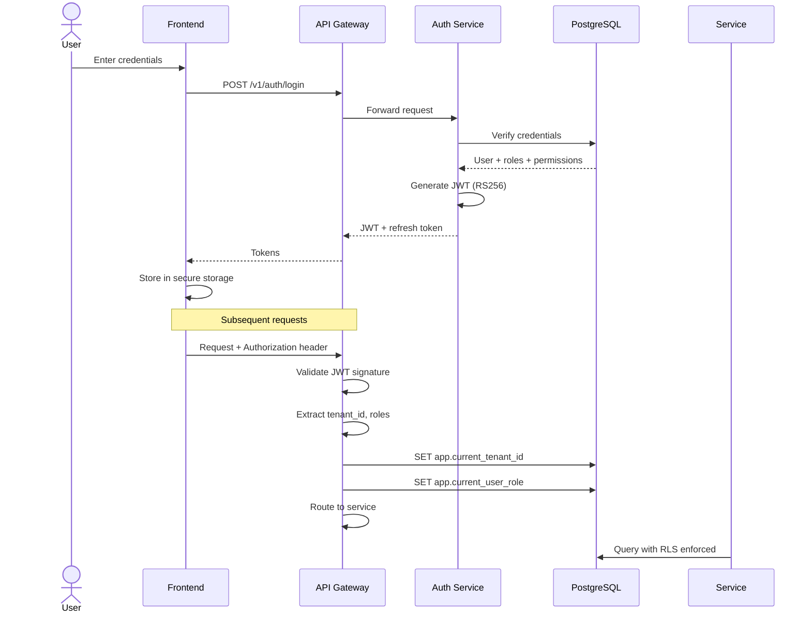

# Phase 0 Foundation — Complete User Role Matrix
## Role Definitions, Permissions, Access Control

**Reference:** FITCORE PRO BLUEPRINT — User Roles & Accounts, Roles & Permissions Table
**Version:** 1.0 | **Date:** June 2026

---

## 1. ROLE HIERARCHY

```
                                ┌──────────────────┐
                                │  SUPER_ADMIN      │
                                │  (FitCore Pro)    │
                                └────────┬─────────┘
                                         │
                          ┌──────────────┴──────────────┐
                          │       COMPANY_STAFF          │
                          │  (Area Manager / Officer)    │
                          └──────────────┬──────────────┘
                                         │
          ┌──────────────────────────────┼──────────────────────────────┐
          │              │               │               │              │
    ┌─────┴─────┐  ┌────┴────┐    ┌─────┴─────┐   ┌────┴────┐   ┌────┴────┐
    │ GYM_OWNER │  │ TRAINER │    │ CUSTOMER  │   │  NUTRIT │   │ SUPP    │
    │           │  │         │    │           │   │ IONIST  │   │ COMPANY │
    └─────┬─────┘  └─────────┘    └───────────┘   └─────────┘   └────┬────┘
          │                                                          │
    ┌─────┴─────┐                                              ┌────┴────┐
    │  EQUIPMENT │                                              │ MAINT   │
    │  MANUFACT  │                                              │ PROVIDER│
    │  URER      │                                              │         │
    └───────────┘                                              └─────────┘
```

---

## 2. ROLE DEFINITIONS

### R1: GYM OWNER / MANAGEMENT
| Property | Detail |
|----------|--------|
| **System Name** | `gym_owner` |
| **Description** | Gym/fitness center owner, branch manager, or operations head |
| **Scope** | Own gym(s) within tenant |
| **Default Dashboard** | Real-time metrics, member count, revenue, attendance |
| **Auto-assigned permissions** | `gym:own:read`, `gym:own:write`, `member:own:read`, `member:own:write`, `trainer:own:read`, `trainer:own:write`, `plan:own:manage`, `equipment:own:read`, `equipment:own:write`, `payment:own:read`, `analytics:own:read`, `supplement:read`, `staff:own:manage` |
| **Blueprint Features** | Dashboard & Analytics, Member Lifecycle, Trainer Management, Supplement Showcase, Equipment & Maintenance, Biometric Integration, Local SEO, Offer Engine, Staff Management |

### R2: TRAINER
| Property | Detail |
|----------|--------|
| **System Name** | `trainer` |
| **Description** | Personal trainer, group instructor (in-gym or independent) |
| **Scope** | Self + assigned clients |
| **Default Dashboard** | Schedule, client progress, earnings, supplement commissions |
| **Auto-assigned permissions** | `profile:own:read`, `profile:own:write`, `client:assigned:read`, `client:assigned:write_workout`, `pt_session:own:read`, `pt_session:own:write`, `supplement:read`, `supplement:recommend`, `earning:own:read`, `analytics:own:read` |
| **Blueprint Features** | Professional Profile, PT Session Management, Client Portfolio, Workout Plan Builder, Supplement Commission Tracking, Earnings Dashboard, In-App Messaging, Discovery Profile |

### R3: CUSTOMER / END-USER
| Property | Detail |
|----------|--------|
| **System Name** | `customer` |
| **Description** | Gym member, fitness enthusiast, end-user |
| **Scope** | Self only |
| **Default Dashboard** | Membership status, upcoming sessions, recent workouts, progress charts |
| **Auto-assigned permissions** | `profile:own:read`, `profile:own:write`, `membership:own:read`, `membership:own:write`, `workout:own:manage`, `biometric:own:manage`, `diet:own:read`, `supplement:read`, `supplement:order`, `booking:own:manage`, `payment:own:read`, `analytics:own:read` |
| **Blueprint Features** | Goal-based Onboarding, Gym Discovery, Membership Purchase, Biometric Entry, Workout & Progress Tracking, Diet & Nutrition Tracking, AI Plans, Supplement Shop, Auto-Renewal, Loyalty & Gamification, Class Booking, Health Integrations |

### R4: NUTRITIONIST
| Property | Detail |
|----------|--------|
| **System Name** | `nutritionist` |
| **Description** | Dietitian, nutrition consultant |
| **Scope** | Assigned clients |
| **Default Dashboard** | Active clients, adherence scores, upcoming consultations |
| **Auto-assigned permissions** | `profile:own:read`, `profile:own:write`, `client:assigned:read`, `client:assigned:write_diet`, `diet_plan:own:manage`, `food_log:assigned:read`, `lab_report:assigned:manage`, `consultation:own:manage`, `supplement:read`, `supplement:recommend`, `earning:own:read`, `analytics:own:read` |
| **Blueprint Features** | Client Management Portal, Diet Plan Builder, Client Food Log Integration, Lab Report Interpretation, Supplement Recommendations, Consultation Booking, Automated Weekly Check-ins, Discovery Profile |

### R5: SUPPLEMENT COMPANY
| Property | Detail |
|----------|--------|
| **System Name** | `supplement_company` |
| **Description** | Supplement brand, distributor, manufacturer |
| **Scope** | Own company products |
| **Default Dashboard** | Product performance, sales by gym/trainer/region |
| **Auto-assigned permissions** | `profile:own:read`, `profile:own:write`, `product:own:manage`, `order:own:read`, `order:own:write_status`, `analytics:own:read`, `campaign:own:manage`, `affiliate:own:read` |
| **Blueprint Features** | Brand Account Setup, Product Catalogue, Virtual Shelf, Sales Analytics, Campaign Tools, Inventory Integration, Affiliate Commission Model |

### R6: EQUIPMENT MANUFACTURER
| Property | Detail |
|----------|--------|
| **System Name** | `equipment_manufacturer` |
| **Description** | Fitness equipment manufacturer, dealer |
| **Scope** | Own products, sales leads |
| **Default Dashboard** | Sales pipeline, AMC renewals, service jobs |
| **Auto-assigned permissions** | `profile:own:read`, `profile:own:write`, `catalogue:own:manage`, `lead:own:read`, `lead:own:write_status`, `amc:own:read`, `amc:own:write`, `service_job:own:read`, `service_job:own:assign`, `analytics:own:read`, `iot:own:receive` |
| **Blueprint Features** | Product Catalogue, Sales Lead Management, Installation & Commissioning, AMC Lifecycle, Maintenance Job Dispatch, Machine Telemetry & Predictive Maintenance, Lead Scoring & Territory Management |

### R7: MAINTENANCE PROVIDER / WORKER
| Property | Detail |
|----------|--------|
| **System Name** | `maintenance_provider` |
| **Description** | Equipment technician, maintenance company |
| **Scope** | Self + assigned/completed jobs |
| **Default Dashboard** | Available jobs, upcoming schedule, earnings |
| **Auto-assigned permissions** | `profile:own:read`, `profile:own:write_availability`, `job:available:read`, `job:own:accept`, `job:own:write_status`, `job:own:write_jobcard`, `earning:own:read`, `rating:own:read` |
| **Blueprint Features** | Job Board, Job Acceptance & Tracking, Digital Job Card, Earnings Dashboard, Rating & Reputation, Availability & Service Zone |

### R8: COMPANY STAFF
| Property | Detail |
|----------|--------|
| **System Name** | `company_staff` |
| **Description** | FitCore Pro internal staff — area managers, field officers, support |
| **Scope** | Territory/assigned region |
| **Default Dashboard** | Territory overview, MRR, churn rate, NPS, onboarding funnel |
| **Auto-assigned permissions** (varies by sub-role) | `gym:territory:read`, `gym:territory:write_onboarding`, `member:all:read`, `trainer:all:read`, `payment:all:read`, `payment:refund`, `analytics:all:read`, `analytics:export`, `staff:own:read`, `staff:ticket:manage`, `commission:own:read` |
| **Blueprint Features** | Area Manager Dashboard, Field Officer App, Onboarding Tracker, Revenue Dashboard, Support Ticket Management, Commission & Incentive Calculator, Fraud & Abuse Detection |

### R9: SUPER ADMIN
| Property | Detail |
|----------|--------|
| **System Name** | `super_admin` |
| **Description** | Full system access, tenant management, configuration |
| **Scope** | All tenants, all data |
| **Default Dashboard** | Global metrics, system health, tenant list |
| **Auto-assigned permissions** | All permissions |
| **Blueprint Features** | Tenant CRUD, feature flags, system health, audit logs, configuration |

---

## 3. SUB-ROLES WITHIN COMPANY STAFF

| Sub-Role | Description | Additional Permissions |
|----------|-------------|----------------------|
| `area_manager` | Territory owner | `gym:territory:write_onboarding`, `staff:territory:read`, `commission:own:read`, `analytics:territory:read` |
| `field_officer` | On-ground gym visits | `gym:territory:read`, `staff:visit:write`, `staff:survey:write`, `staff:ticket:read` |
| `support_agent` | Ticket resolution | `staff:ticket:manage`, `payment:read`, `payment:refund` |
| `account_manager` | Enterprise relationships | `gym:all:read`, `gym:all:write_plan`, `analytics:all:read` |
| `compliance_officer` | Fraud, disputes, audits | `payment:all:read`, `payment:refund`, `audit:all:read`, `staff:dispute:manage` |

---

## 4. PERMISSION GRID (Complete)

| # | Permission Name | R1 | R2 | R3 | R4 | R5 | R6 | R7 | R8 | R9 |
|---|----------------|:--:|:--:|:--:|:--:|:--:|:--:|:--:|:--:|:--:|
| | **Auth & Profile** | | | | | | | | | |
| P01 | `auth:register` | - | - | ✓ | - | - | - | - | - | ✓ |
| P02 | `auth:login` | ✓ | ✓ | ✓ | ✓ | ✓ | ✓ | ✓ | ✓ | ✓ |
| P03 | `profile:own:read` | ✓ | ✓ | ✓ | ✓ | ✓ | ✓ | ✓ | ✓ | ✓ |
| P04 | `profile:own:write` | ✓ | ✓ | ✓ | ✓ | ✓ | ✓ | ✓ | ✓ | ✓ |
| | **Gym Management** | | | | | | | | | |
| P05 | `gym:create` | ✓ | - | - | - | - | - | - | - | ✓ |
| P06 | `gym:own:read` | ✓ | - | - | - | - | - | - | ✓ | ✓ |
| P07 | `gym:own:write` | ✓ | - | - | - | - | - | - | - | ✓ |
| P08 | `gym:own:delete` | ✓ | - | - | - | - | - | - | - | ✓ |
| P09 | `gym:all:read` | - | - | - | - | - | - | - | ✓ | ✓ |
| P10 | `gym:all:write` | - | - | - | - | - | - | - | - | ✓ |
| P11 | `gym:own:invite_staff` | ✓ | - | - | - | - | - | - | - | ✓ |
| | **Membership Plans** | | | | | | | | | |
| P12 | `plan:own:create` | ✓ | - | - | - | - | - | - | - | ✓ |
| P13 | `plan:own:read` | ✓ | ✓ | ✓ | - | - | - | - | ✓ | ✓ |
| P14 | `plan:own:write` | ✓ | - | - | - | - | - | - | - | ✓ |
| P15 | `plan:own:delete` | ✓ | - | - | - | - | - | - | - | ✓ |
| | **Member Management** | | | | | | | | | |
| P16 | `member:own:read` | ✓ | ✓ | Self | ✓ | - | - | - | ✓ | ✓ |
| P17 | `member:own:create` | ✓ | - | - | - | - | - | - | - | ✓ |
| P18 | `member:own:write` | ✓ | ✓ | Self | - | - | - | - | - | ✓ |
| P19 | `member:own:delete` | ✓ | - | Self | - | - | - | - | - | ✓ |
| P20 | `member:all:read` | - | - | - | - | - | - | - | ✓ | ✓ |
| | **Trainer Management** | | | | | | | | | |
| P21 | `trainer:own:create` | ✓ | - | - | - | - | - | - | - | ✓ |
| P22 | `trainer:own:read` | ✓ | Self | ✓ | - | - | - | - | ✓ | ✓ |
| P23 | `trainer:own:write` | ✓ | Self | - | - | - | - | - | - | ✓ |
| P24 | `trainer:own:delete` | ✓ | - | - | - | - | - | - | - | ✓ |
| P25 | `trainer:all:read` | - | - | - | - | - | - | - | ✓ | ✓ |
| | **PT Sessions & Bookings** | | | | | | | | | |
| P26 | `booking:own:create` | - | ✓ | ✓ | ✓ | - | - | - | - | ✓ |
| P27 | `booking:own:read` | ✓ | ✓ | ✓ | ✓ | - | - | - | ✓ | ✓ |
| P28 | `booking:own:write` | - | ✓ | Self | ✓ | - | - | - | - | ✓ |
| P29 | `booking:own:cancel` | - | ✓ | ✓ | ✓ | - | - | - | - | ✓ |
| P30 | `booking:all:read` | - | - | - | - | - | - | - | ✓ | ✓ |
| P31 | `class:own:manage` | ✓ | ✓ | - | - | - | - | - | - | ✓ |
| | **Workout & Progress** | | | | | | | | | |
| P32 | `workout:own:manage` | - | ✓ | ✓ | - | - | - | - | - | ✓ |
| P33 | `workout:client:read` | - | ✓ | - | - | - | - | - | - | ✓ |
| P34 | `workout:client:write` | - | ✓ | - | - | - | - | - | - | ✓ |
| P35 | `exercise_library:read` | ✓ | ✓ | ✓ | - | - | - | - | ✓ | ✓ |
| | **Body Metrics** | | | | | | | | | |
| P36 | `metric:own:manage` | - | ✓ | ✓ | - | - | - | - | - | ✓ |
| P37 | `metric:client:read` | - | ✓ | - | ✓ | - | - | - | - | ✓ |
| P38 | `metric:client:write` | - | ✓ | - | ✓ | - | - | - | - | ✓ |
| P39 | `biometric_device:manage` | ✓ | - | - | - | - | - | - | - | ✓ |
| | **Nutrition & Diet** | | | | | | | | | |
| P40 | `diet_plan:own:create` | - | - | - | ✓ | - | - | - | - | ✓ |
| P41 | `diet_plan:own:read` | - | - | ✓ | ✓ | - | - | - | ✓ | ✓ |
| P42 | `diet_plan:own:write` | - | - | - | ✓ | - | - | - | - | ✓ |
| P43 | `food_log:own:manage` | - | - | ✓ | - | - | - | - | - | ✓ |
| P44 | `food_log:client:read` | - | - | - | ✓ | - | - | - | - | ✓ |
| P45 | `lab_report:manage` | - | - | Self | ✓ | - | - | - | - | ✓ |
| | **Supplements** | | | | | | | | | |
| P46 | `supplement:read` | ✓ | ✓ | ✓ | ✓ | ✓ | - | - | ✓ | ✓ |
| P47 | `supplement:own:create` | - | - | - | - | ✓ | - | - | - | ✓ |
| P48 | `supplement:own:write` | - | - | - | - | ✓ | - | - | - | ✓ |
| P49 | `supplement:own:delete` | - | - | - | - | ✓ | - | - | - | ✓ |
| P50 | `supplement:recommend` | - | ✓ | - | ✓ | - | - | - | - | ✓ |
| P51 | `supplement_order:create` | - | - | ✓ | - | - | - | - | - | ✓ |
| P52 | `supplement_order:own:read` | ✓ | - | ✓ | - | ✓ | - | - | ✓ | ✓ |
| P53 | `supplement_order:own:write_status` | - | - | - | - | ✓ | - | - | - | ✓ |
| P54 | `supplement_order:cancel` | - | - | ✓ | - | ✓ | - | - | - | ✓ |
| P55 | `supplement:campaign:manage` | - | - | - | - | ✓ | - | - | - | ✓ |
| | **Equipment** | | | | | | | | | |
| P56 | `equipment:own:create` | ✓ | - | - | - | - | ✓ | - | - | ✓ |
| P57 | `equipment:own:read` | ✓ | - | - | - | - | ✓ | - | ✓ | ✓ |
| P58 | `equipment:own:write` | ✓ | - | - | - | - | ✓ | - | - | ✓ |
| P59 | `equipment:own:delete` | ✓ | - | - | - | - | ✓ | - | - | ✓ |
| P60 | `equipment:all:read` | - | - | - | - | - | - | - | ✓ | ✓ |
| P61 | `equipment_lead:read` | - | - | - | - | - | ✓ | - | ✓ | ✓ |
| P62 | `equipment_lead:write_status` | - | - | - | - | - | ✓ | - | ✓ | ✓ |
| P63 | `amc:own:read` | ✓ | - | - | - | - | ✓ | - | ✓ | ✓ |
| P64 | `amc:own:write` | ✓ | - | - | - | - | ✓ | - | - | ✓ |
| | **Maintenance** | | | | | | | | | |
| P65 | `maintenance_job:create` | ✓ | - | - | - | - | - | ✓ | ✓ | ✓ |
| P66 | `maintenance_job:available:read` | - | - | - | - | - | - | ✓ | - | ✓ |
| P67 | `maintenance_job:own:accept` | - | - | - | - | - | - | ✓ | - | ✓ |
| P68 | `maintenance_job:own:write_status` | - | - | - | - | - | - | ✓ | - | ✓ |
| P69 | `maintenance_job:own:write_jobcard` | - | - | - | - | - | - | ✓ | - | ✓ |
| P70 | `maintenance_job:own:read` | ✓ | - | - | - | - | ✓ | ✓ | ✓ | ✓ |
| | **Payments** | | | | | | | | | |
| P71 | `payment:create` | ✓ | - | ✓ | - | - | - | - | - | ✓ |
| P72 | `payment:own:read` | ✓ | ✓ | ✓ | ✓ | ✓ | ✓ | ✓ | ✓ | ✓ |
| P73 | `payment:all:read` | - | - | - | - | - | - | - | ✓ | ✓ |
| P74 | `payment:refund` | - | - | - | - | - | - | - | limited | ✓ |
| P75 | `payout:own:read` | ✓ | ✓ | - | ✓ | ✓ | ✓ | ✓ | ✓ | ✓ |
| | **Analytics & Reports** | | | | | | | | | |
| P76 | `analytics:own:read` | ✓ | ✓ | ✓ | ✓ | ✓ | ✓ | ✓ | ✓ | ✓ |
| P77 | `analytics:all:read` | - | - | - | - | - | - | - | ✓ | ✓ |
| P78 | `analytics:export` | ✓ | ✓ | ✓ | ✓ | ✓ | ✓ | ✓ | ✓ | ✓ |
| P79 | `analytics:mrr:read` | - | - | - | - | - | - | - | ✓ | ✓ |
| P80 | `analytics:churn:read` | ✓ | - | - | - | - | - | - | ✓ | ✓ |
| P81 | `analytics:cohort:read` | - | - | - | - | - | - | - | ✓ | ✓ |
| | **Notifications** | | | | | | | | | |
| P82 | `notification:own:read` | ✓ | ✓ | ✓ | ✓ | ✓ | ✓ | ✓ | ✓ | ✓ |
| P83 | `notification:preferences:write` | ✓ | ✓ | ✓ | ✓ | ✓ | ✓ | ✓ | ✓ | ✓ |
| P84 | `notification:send` | - | - | - | - | - | - | - | internal | ✓ |
| | **AI Services** | | | | | | | | | |
| P85 | `ai:churn:read` | ✓ | - | - | - | - | - | - | ✓ | ✓ |
| P86 | `ai:recommendation:workout` | - | ✓ | ✓ | - | - | - | - | - | ✓ |
| P87 | `ai:recommendation:diet` | - | - | ✓ | ✓ | - | - | - | - | ✓ |
| P88 | `ai:recommendation:supplement` | - | ✓ | ✓ | ✓ | - | - | - | - | ✓ |
| P89 | `ai:offer:generate` | ✓ | - | - | - | - | - | - | ✓ | ✓ |
| | **Staff Operations** | | | | | | | | | |
| P90 | `staff:dashboard:read` | - | - | - | - | - | - | - | ✓ | ✓ |
| P91 | `staff:field_visit:write` | - | - | - | - | - | - | - | ✓ | ✓ |
| P92 | `staff:nps:manage` | - | - | - | - | - | - | - | ✓ | ✓ |
| P93 | `staff:onboarding:read` | ✓ | - | - | - | - | - | - | ✓ | ✓ |
| P94 | `staff:ticket:create` | ✓ | ✓ | ✓ | ✓ | ✓ | ✓ | ✓ | ✓ | ✓ |
| P95 | `staff:ticket:manage` | - | - | - | - | - | - | - | ✓ | ✓ |
| P96 | `staff:commission:read` | - | - | - | - | - | - | - | ✓ | ✓ |
| P97 | `staff:fraud:read` | - | - | - | - | - | - | - | ✓ | ✓ |
| | **Admin & System** | | | | | | | | | |
| P98 | `admin:tenant:manage` | - | - | - | - | - | - | - | - | ✓ |
| P99 | `admin:feature_flags:write` | - | - | - | - | - | - | - | - | ✓ |
| P100 | `admin:system_health:read` | - | - | - | - | - | - | - | ✓ | ✓ |
| P101 | `admin:audit_log:read` | - | - | - | - | - | - | - | ✓ | ✓ |
| P102 | `admin:all` | - | - | - | - | - | - | - | - | ✓ |

---

## 5. DATA SCOPING RULES

| Role | Can Read | Can Write | Can Delete |
|------|----------|-----------|------------|
| **gym_owner** | Own gym data + members/trainers in gym | Own gym, own members, own plans | Own gym and its associated data |
| **trainer** | Self + assigned clients only | Self profile + assigned client workouts | Nothing at database level |
| **customer** | Self only | Self profile + own workouts/metrics | Self account (soft delete) |
| **nutritionist** | Assigned clients only | Diet plans for assigned clients | Own diet plans (soft) |
| **supplement_company** | Own products, own orders, own analytics | Own products, own order status | Own products (soft) |
| **equipment_manufacturer** | Own catalogue + sales leads | Own catalogue + lead status | Own catalogue (soft) |
| **maintenance_provider** | Available jobs + own jobs | Own job cards | Nothing |
| **company_staff** | Assigned territory all data | Limited (tickets, NPS, field visits) | Nothing |
| **super_admin** | All tenants, all data | All entities | All entities (hard with audit) |

---

## 6. AUTHENTICATION FLOW



---

## 7. PERMISSION CHECK IMPLEMENTATION (NestJS Decorator)

```typescript
// Guard checks JWT → extracts permissions → compares with route requirement
@Controller('gyms')
export class GymsController {
  @Post()
  @UseGuards(JwtAuthGuard, RolesGuard)
  @Roles('gym_owner', 'super_admin')
  @Permissions('gym:create')
  async createGym(@Body() dto: CreateGymDto) { ... }

  @Get(':id')
  @UseGuards(JwtAuthGuard)
  @Scopes('gym:own:read')    // Auto-filters by tenant + ownership
  async getGym(@Param('id') id: string) { ... }
}
```

---

*End of Document — User Role Matrix v1.0*
